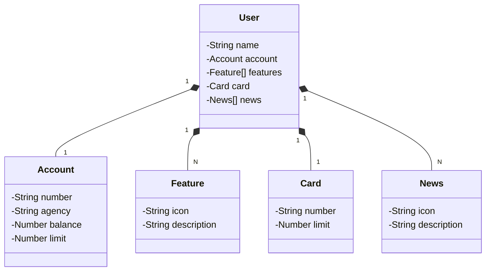

# Desafio IA Generativa ETL Python   [](https://www.dio.me/users/marlon_s_macedo) 
### Desafio de projeto de ETL para o Bootcamp de CIencia de dados com Python - Santander 2023

*Esse desafio conta um uma API desenvolvida pela DIO em Java 17 com Spring Boot 3 do Bootcamp Santander Dev Week 2023.*

**Contexto:** Você é um cientista de dados no Santander e recebeu a tarefa de envolver seus clientes de maneira mais personalizada. Seu objetivo é usar o poder da IA Generativa para criar mensagens de marketing personalizadas que serão entregues a cada cliente.

**Condições do Problema:**

1. Você recebeu uma planilha simples, em formato CSV ('SDW2023.csv'), com uma lista de IDs de usuário do banco:
  ```
  UserID
  1
  2
  3
  4
  5
  ```
2. Seu trabalho é consumir o endpoint `GET https://sdw-2023-prd.up.railway.app/users/{id}` (API da Santander Dev Week 2023) para obter os dados de cada cliente.
3. Depois de obter os dados dos clientes, você vai usar a API do ChatGPT (OpenAI) para gerar uma mensagem de marketing personalizada para cada cliente. Essa mensagem deve enfatizar a importância dos investimentos.
4. Uma vez que a mensagem para cada cliente esteja pronta, você vai enviar essas informações de volta para a API, atualizando a lista de "news" de cada usuário usando o endpoint `PUT https://sdw-2023-prd.up.railway.app/users/{id}`.


RESTful API da Santander Dev Week 2023 construída em Java 17 com Spring Boot 3.


## Diagrama de Classes (Domínio da API)



## Documentação da API (Swagger)

### [https://sdw-2023-prd.up.railway.app/swagger-ui.html](https://sdw-2023-prd.up.railway.app/swagger-ui.html)


